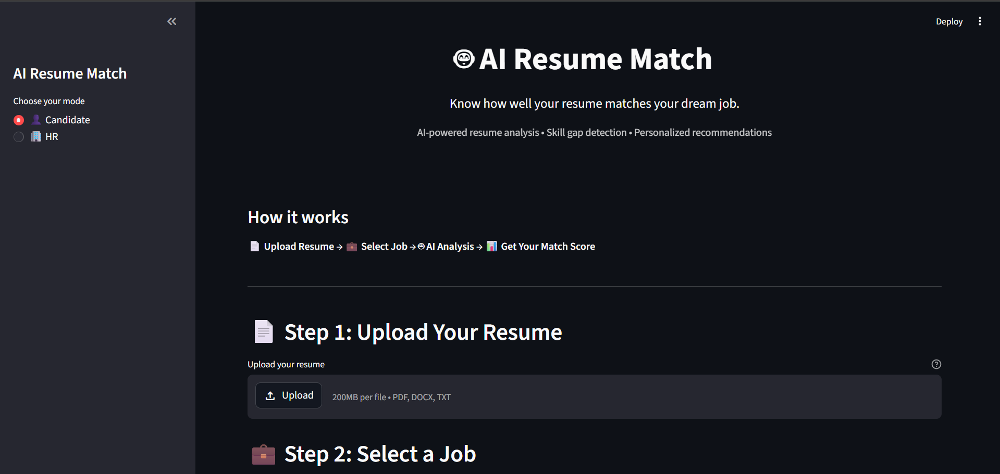
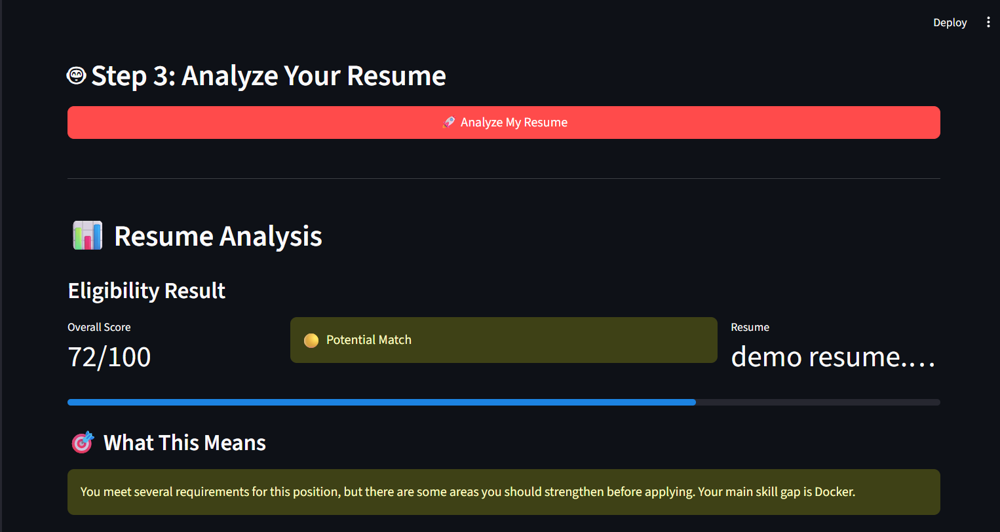
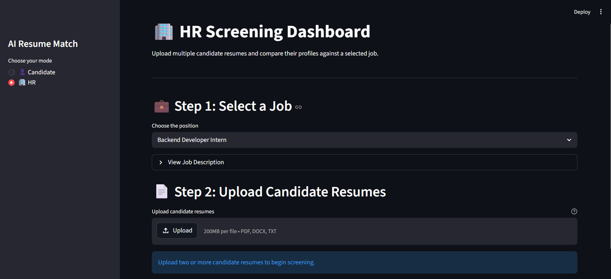
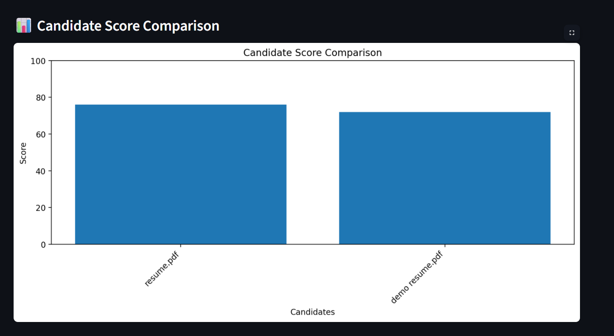

# 🤖 AI Resume Match

An AI-powered **Resume Screening and Job Matching Platform** built using **Python, Streamlit, and the Groq LLM API**.

AI Resume Match provides separate workflows for **job candidates** and **HR/recruiters**. Candidates can upload their resumes to evaluate how well they match a job, while HR users can screen multiple resumes, rank candidates, filter results, compare candidates, visualize scores, and generate screening reports.

---

## 🚀 Live Demo

🌐 **[Try AI Resume Match](https://ai-hr-resume-screening-dwbc9suxthbrtcmqudwzru.streamlit.app/)**

---

## 📌 Overview

Traditional resume screening can be time-consuming, especially when recruiters need to compare many candidates against the same job requirements.

AI Resume Match uses a Large Language Model through the **Groq API** to semantically compare resumes with job descriptions.

The system evaluates candidates across multiple criteria and generates a structured score out of **100**.

The application contains two main modes:

- 👤 **Candidate Mode**
- 🏢 **HR Screening Mode**

---

# 👤 Candidate Mode

Candidate Mode allows an applicant to upload their resume and evaluate how well their profile matches a selected job.

### Workflow

```text
Upload Resume
      │
      ▼
Select Job
      │
      ▼
Extract Resume Content
      │
      ▼
Groq LLM Analysis
      │
      ▼
Validate AI Response
      │
      ▼
Calculate Match Score
      │
      ├── Matched Skills
      ├── Missing Skills
      ├── Strengths
      └── Improvement Suggestions
```

### Candidate Features

- Upload a personal resume
- Support for PDF, DOCX, and TXT resumes
- Select from available job descriptions
- View the complete job description
- Analyze the resume using AI
- Receive an overall match score out of 100
- View category-wise scores
- Identify matched skills
- Identify missing skills
- View candidate strengths
- Receive improvement suggestions
- View an overall match status
- Generate a resume analysis report

---

# 🏢 HR Screening Dashboard

HR Mode allows recruiters to screen multiple candidates against the same job description.

### Workflow

```text
Select Job
     │
     ▼
Upload Multiple Resumes
     │
     ▼
Extract Resume Content
     │
     ▼
Groq LLM Analysis
     │
     ▼
Validate Candidate Scores
     │
     ▼
Rank Candidates
     │
     ├───────────────┐
     ▼               ▼
Apply Filters    Score Visualization
     │
     ▼
Compare Candidates
     │
     ▼
Select Top Candidates
     │
     ▼
Hiring Recommendation
     │
     ▼
Generate HR Report
```

### HR Features

- Select a job position
- Upload multiple candidate resumes
- Batch-analyze candidate profiles
- Automatically rank candidates
- View candidate scores
- View screening statistics
- Calculate average candidate score
- Identify the highest score
- Identify the top candidate
- Filter candidates by minimum score
- Filter candidates by match status
- Compare two candidates side-by-side
- Compare category-wise scores
- Compare matched skills
- Compare skill gaps
- Visualize candidate scores
- View Top 5 candidates
- Generate hiring recommendations
- Generate an HR screening report
- Download the screening report

---

# ✨ Key Features

- 🤖 AI-powered resume analysis
- 📄 PDF, DOCX, and TXT resume support
- 💼 Multiple job descriptions
- 🎯 Resume-to-job semantic matching
- 📊 100-point candidate scoring system
- 🧠 Category-wise AI evaluation
- 🏆 Automatic candidate ranking
- 🔎 Candidate filtering
- ⚖️ Side-by-side candidate comparison
- 📈 Candidate score visualization
- ⭐ Top 5 candidate selection
- 💪 Strength identification
- ⚠️ Skill-gap detection
- 🚀 Improvement recommendations
- 📄 Downloadable screening reports
- 🔐 Secure API key handling
- ⚠️ API rate-limit handling
- 🌐 Deployed Streamlit web application

---

# 📊 Evaluation Criteria

Each candidate is evaluated across six categories.

| Category | Maximum Score |
|---|---:|
| Technical Skills | 30 |
| Experience | 20 |
| Education | 10 |
| Certifications | 10 |
| Domain Knowledge | 15 |
| Soft Skills | 15 |
| **Total** | **100** |

The final score is calculated from the individual category scores.

---

# 🎯 Match Levels

Candidates are classified according to their final score.

| Score | Match Status |
|---:|---|
| 90–100 | 🟢 Strong Match |
| 80–89 | 🔵 Good Match |
| 70–79 | 🟡 Potential Match |
| Below 70 | 🔴 Low Match |

---

# 🧠 AI Evaluation

The application uses the **Groq API** with:

**Llama 3.1 8B Instant**

The LLM receives the selected job description and extracted resume content.

It is instructed to:

- Compare the candidate against the selected job
- Evaluate all six scoring categories
- Follow predefined category score limits
- Use only information contained in the resume
- Avoid inventing candidate qualifications
- Treat missing information as missing
- Identify matched skills
- Identify missing skills
- Identify candidate strengths
- Generate improvement suggestions
- Generate a concise candidate summary
- Return structured JSON

The structured response allows the Python application to validate the AI output before displaying the results.

---

# 🔄 Score Validation

The application does not blindly trust the overall score generated by the LLM.

Every category score is validated against its maximum allowed value:

```text
Technical Skills     → 0–30
Experience           → 0–20
Education            → 0–10
Certifications       → 0–10
Domain Knowledge     → 0–15
Soft Skills          → 0–15
```

The application then calculates the final score itself:

```text
Final Score =
Technical Skills
+ Experience
+ Education
+ Certifications
+ Domain Knowledge
+ Soft Skills
```

This calculated value becomes the final candidate score.

This provides an additional validation layer between the LLM response and the result shown to the user.

---

# 🔐 Responsible AI

The application is designed as a **decision-support tool**, not an autonomous hiring system.

The evaluation prompt explicitly instructs the model not to consider protected or unrelated personal characteristics such as:

- Gender
- Race
- Religion
- Nationality
- Age
- Disability
- Other unrelated personal characteristics

Candidate evaluations should always be reviewed by qualified human recruiters before making employment decisions.

---

# 🛠️ Tech Stack

| Technology | Purpose |
|---|---|
| **Python** | Core application logic |
| **Streamlit** | Web application interface |
| **Groq API** | LLM inference |
| **Llama 3.1 8B Instant** | Resume and job analysis |
| **PyPDF** | PDF resume extraction |
| **python-docx** | DOCX resume extraction |
| **Matplotlib** | Score visualization |
| **python-dotenv** | Local environment variable management |
| **Git & GitHub** | Version control |
| **Streamlit Community Cloud** | Deployment |

---

# 📁 Project Structure

```text
AI-HR-Resume-Screening/
│
├── streamlit_app.py
├── app.py
├── requirements.txt
├── README.md
├── .gitignore
├── .env.example
│
├── jobs/
│   ├── backend_developer_intern.md
│   ├── data_analyst_intern.md
│   └── frontend_developer_intern.md
│
├── inputs/
│   ├── job_description.md
│   │
│   └── profiles/
│       ├── candidate1.md
│       ├── candidate2.md
│       ├── candidate3.md
│       └── ...
│
└── outputs/
    ├── report.md
    └── scores.png
```

### Main Files

`streamlit_app.py`

Main Streamlit application containing the Candidate and HR workflows.

`app.py`

Original command-line implementation of the AI HR Resume Screening Assistant.

`jobs/`

Contains job descriptions used by the Streamlit application.

`inputs/`

Contains sample inputs used by the original command-line implementation.

`outputs/`

Contains sample reports and score visualizations generated by the original implementation.

---

# 💼 Available Jobs

Job descriptions are stored inside:

```text
jobs/
```

Current example positions include:

```text
backend_developer_intern.md
data_analyst_intern.md
frontend_developer_intern.md
```

Additional jobs can be added by placing new Markdown job descriptions inside the `jobs/` directory.

The application automatically reads available job descriptions.

---

# ⚙️ Requirements

Before running the application locally, make sure you have:

- Python 3.x
- pip
- Internet connection
- Groq API key

---

# 🚀 Installation

## 1. Clone the Repository

```bash
git clone https://github.com/Muskan25-jssateb/AI-HR-Resume-Screening.git
```

Move into the project directory:

```bash
cd AI-HR-Resume-Screening
```

---

## 2. Install Dependencies

```bash
pip install -r requirements.txt
```

The project uses:

```text
groq
python-dotenv
matplotlib
streamlit
pypdf
python-docx
```

---

# 🔑 Groq API Configuration

Create a Groq API key from the Groq Console.

For local development, create a `.env` file in the project root:

```text
GROQ_API_KEY=your_groq_api_key_here
```

You can use:

```text
.env.example
```

as a template.

> ⚠️ Never commit your actual `.env` file or Groq API key to GitHub.

The `.gitignore` file prevents `.env` from being tracked.

---

# ▶️ Running the Application

Run the Streamlit application with:

```bash
streamlit run streamlit_app.py
```

Streamlit will start the development server and open the application in your browser.

You can then choose between:

```text
👤 Candidate Mode

or

🏢 HR Mode
```

---

# 👤 Using Candidate Mode

### Step 1 — Select a Job

Choose one of the available positions.

### Step 2 — Upload Resume

Supported formats:

```text
PDF
DOCX
TXT
```

### Step 3 — Analyze

Click:

```text
🚀 Analyze My Resume
```

The application will:

1. Extract resume text
2. Send the resume and job description to Groq
3. Receive a structured AI evaluation
4. Validate the category scores
5. Calculate the final score
6. Determine the match status
7. Display the results

The candidate can then view:

- Overall score
- Match status
- Category scores
- Matched skills
- Missing skills
- Strengths
- Improvement suggestions
- Summary

---

# 🏢 Using HR Mode

### Step 1 — Select Job

Select the position for which candidates are being screened.

### Step 2 — Upload Resumes

Upload two or more candidate resumes.

### Step 3 — Analyze Candidates

Click:

```text
🚀 Analyze All Candidates
```

Each candidate is evaluated against the same job description.

### Step 4 — View Screening Statistics

The dashboard displays:

- Candidates screened
- Average score
- Highest score
- Top candidate

### Step 5 — Filter Candidates

Candidates can be filtered using:

```text
Minimum Score
Match Status
```

For example:

```text
Minimum Score: 80
Match Status: Good Match
```

### Step 6 — View Ranking

Candidates are automatically ranked from highest to lowest score.

### Step 7 — Compare Candidates

Select two candidates to compare their:

- Overall scores
- Technical skills
- Experience
- Education
- Certifications
- Domain knowledge
- Soft skills
- Matched skills
- Skill gaps

### Step 8 — View Top Candidates

The application displays up to the Top 5 candidates from the screening results.

### Step 9 — Hiring Recommendation

The highest-ranked candidate is highlighted and an overall recommendation is displayed.

### Step 10 — Download Report

HR can generate and download the screening report as a Markdown file.

---

# 📈 Candidate Score Visualization

The HR dashboard generates a bar chart comparing candidate scores.

This provides a quick visual representation of how candidates performed against the selected job requirements.

---

# 📄 Reports

The application can generate structured reports containing:

- Job position
- Candidate ranking
- Candidate scores
- Match status
- Category-wise evaluation
- Matched skills
- Skill gaps
- Candidate strengths
- Improvement areas
- Top candidates
- Hiring recommendation

---

# ⚠️ Error Handling

The application handles common errors including:

- Missing Groq API key
- Missing job descriptions
- Unsupported resume formats
- Empty resume files
- Resume extraction failures
- Groq API request failures
- Groq API rate limits
- Empty AI responses
- Invalid JSON responses
- Invalid category scores
- Missing evaluation categories

If the Groq API rate limit is reached during HR batch analysis, the application stops additional requests and informs the user instead of repeatedly sending failing requests.

---

# 🌐 Deployment

The application is deployed using **Streamlit Community Cloud**.

For production deployment, the Groq API key is stored using Streamlit's secure **Secrets** configuration.

Example:

```toml
GROQ_API_KEY = "your_groq_api_key"
```

The actual API key is never stored in the public GitHub repository.

### Live Application

🌐 **[Open AI Resume Match](https://ai-hr-resume-screening-dwbc9suxthbrtcmqudwzru.streamlit.app/)**

---

# 📸 Screenshots

## 👤 Candidate Mode



## 📊 Candidate Analysis



## 🏢 HR Screening Dashboard



## 🔍 Candidate Comparison



---

# 🔮 Future Improvements

Possible future improvements include:

- User authentication
- Recruiter accounts
- Candidate accounts
- Database-backed candidate storage
- Resume analysis history
- Job recommendation system
- Candidate-to-job recommendations
- Resume improvement assistant
- Advanced semantic candidate search
- Recruiter analytics
- PDF report export
- Email notifications
- Interview scheduling integration
- More advanced LLM evaluation pipelines

---

# 🔒 Security

Sensitive configuration such as the Groq API key is not stored in the repository.

The following files are excluded using `.gitignore`:

```text
.env
.streamlit/secrets.toml
```

An `.env.example` file is provided to demonstrate the required environment variable without exposing credentials.

---

# ⚠️ Disclaimer

This project is intended for **educational and demonstration purposes**.

AI-generated resume scores and candidate evaluations are intended to assist users and recruiters and should not be treated as definitive employment decisions.

All candidate evaluations should be reviewed by qualified human recruiters before making hiring decisions.

The application should **not be used as the sole basis for employment decisions**.

---

## 👩‍💻 Author

**Muskan**

CSE (AI & ML) Student | Software Development | Backend Development | AI/ML

---

⭐ If you find this project useful, consider giving the repository a star!