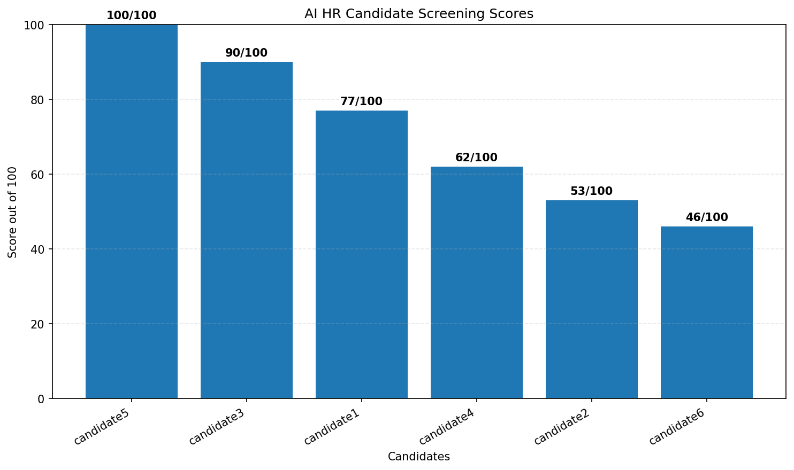

# AI HR Resume Screening Assistant

An AI-powered HR assistant that uses the **Groq LLM API** to evaluate, score, and rank multiple candidates against a given job description.

The application reads a job description and multiple candidate profiles, sends them to an LLM for semantic comparison, evaluates each candidate across six categories, recommends the Top 5 candidates, and generates both a Markdown report and a score visualization.

---

## Features

- Read a job description from a Markdown/Text file
- Read multiple candidate profiles automatically
- Analyze candidates using the Groq LLM API
- Compare candidates against job requirements
- Evaluate candidates across six categories
- Generate a score out of 100 for every candidate
- Rank all candidates
- Recommend the Top 5 candidates
- Generate an AI-powered job summary
- Generate hiring recommendations
- Generate a detailed Markdown report
- Generate a candidate score bar chart
- Handle missing files and API errors

---

## Evaluation Criteria

Each candidate is evaluated using the following scoring system:

| Category | Maximum Score |
|---|---:|
| Technical Skills | 30 |
| Experience | 20 |
| Education | 10 |
| Certifications | 10 |
| Domain Knowledge | 15 |
| Soft Skills | 15 |
| **Total** | **100** |

The individual category scores must add up to the candidate's final score.

---

## Tech Stack

- **Python**
- **Groq API**
- **Llama 3.3 70B Versatile**
- **Matplotlib**
- **python-dotenv**

---

## Project Structure

```text
AI HR Resume Screening/
│
├── app.py
├── requirements.txt
├── .env
├── .env.example
├── .gitignore
│
├── inputs/
│   ├── job_description.md
│   │
│   └── profiles/
│       ├── candidate1.md
│       ├── candidate2.md
│       ├── candidate3.md
│       └── ...
│
└── outputs/
    ├── report.md
    └── scores.png
```

> **Note:** `.env` contains the Groq API key and must not be committed to GitHub.

---

## How It Works

```text
             Job Description
                    │
                    ▼
          Read Job Description
                    │
                    ▼
          Read Candidate Profiles
                    │
                    ▼
             Groq LLM Analysis
                    │
                    ▼
          Candidate Evaluation
                    │
        ┌───────────┴───────────┐
        ▼                       ▼
     Scores                 Remarks
        │                       │
        └───────────┬───────────┘
                    ▼
              Rank Candidates
                    │
                    ▼
              Select Top 5
                    │
          ┌─────────┴─────────┐
          ▼                   ▼
      report.md           scores.png
```

---

## Requirements

Before running the project, make sure you have:

- Python 3.x
- A Groq API key
- Internet connection

---

## Installation

### 1. Clone the repository

After creating the GitHub repository, replace `YOUR_REPOSITORY_URL` with your actual repository URL.

```bash
git clone YOUR_REPOSITORY_URL
cd "AI HR Resume Screening"
```

### 2. Install dependencies

```bash
pip install -r requirements.txt
```

---

## Groq API Key Setup

Create a Groq API key from the Groq Console.

Create a `.env` file in the project root:

```text
GROQ_API_KEY=your_groq_api_key_here
```

You can use `.env.example` as a template.

**Never commit your real `.env` file or API key to GitHub.**

---

## Input Files

### Job Description

Place the job description in:

```text
inputs/job_description.md
```

The file can contain information such as:

- Job role
- Technical requirements
- Experience requirements
- Education
- Certifications
- Domain knowledge
- Soft skills

### Candidate Profiles

Place candidate profiles inside:

```text
inputs/profiles/
```

Supported file formats:

```text
.md
.txt
```

Example:

```text
inputs/profiles/
├── candidate1.md
├── candidate2.md
├── candidate3.md
├── candidate4.md
└── candidate5.md
```

The application automatically detects candidate files, so new profiles can be added without modifying the Python code.

---

## Running the Application

From the project directory, run:

```bash
python app.py
```

The application will:

1. Read the job description
2. Read all candidate profiles
3. Send the information to Groq
4. Evaluate every candidate
5. Generate candidate scores
6. Rank candidates
7. Select the Top 5
8. Generate the Markdown report
9. Generate the score visualization

---

## Output

The application generates two files inside the `outputs/` directory.

### 1. `report.md`

The report contains:

- Job Summary
- Screening Overview
- Candidate Evaluation
- Detailed Candidate Evaluation
- Category-wise scores
- Candidate strengths
- Candidate weaknesses
- Top 5 Candidates
- Hiring Recommendation

[View Sample Screening Report](outputs/report.md)

### 2. `scores.png`

A bar chart showing the score of every candidate out of 100.



---

## Example Ranking

A sample run may produce a ranking such as:

| Rank | Candidate | Score |
|---:|---|---:|
| 1 | candidate5 | 96 |
| 2 | candidate3 | 90 |
| 3 | candidate1 | 81 |
| 4 | candidate4 | 60 |
| 5 | candidate2 | 50 |
| 6 | candidate6 | 32 |

Scores are generated by the LLM based on the job description and candidate profiles.

---

## Prompt Engineering

The application uses a structured evaluation prompt that instructs the LLM to:

- Compare every candidate against the job description
- Evaluate six predefined categories
- Follow a 100-point scoring rubric
- Use only information present in the supplied profiles
- Avoid inventing candidate qualifications
- Treat missing information as missing
- Ensure category scores add up to the final score
- Rank all candidates
- Recommend the Top 5
- Generate an overall hiring recommendation

The application also requests a JSON response so that the AI output can be processed programmatically by Python.

---

## Error Handling

The application handles common problems such as:

- Missing job description
- Missing candidate profiles
- Missing Groq API key
- Groq API request failures
- Empty AI responses
- Invalid AI JSON responses

---

## Sample Output

The generated report and score chart are stored in:

```text
outputs/
├── report.md
└── scores.png
```

---

## Future Improvements

Possible future improvements include:

- Streamlit web interface
- PDF resume support
- Resume upload functionality
- Database storage
- Candidate search and filtering
- Batch processing for larger candidate pools
- Candidate comparison dashboard
- Export reports to PDF
- More advanced structured LLM outputs

---

## Disclaimer

This project is intended for educational and demonstration purposes.

AI-generated candidate evaluations should be reviewed by qualified human recruiters before making actual hiring decisions.